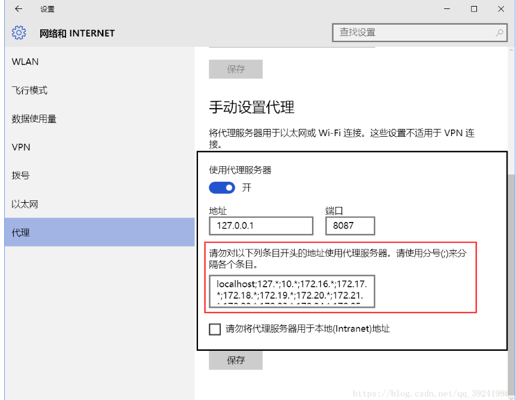

1.
  * problem:
    - Selenium support for PhantomJS has been deprecated, please use headless
  * reason:
    - Selenium won't support PhantomJS anymore
  * solution:
    - use headless Firefox or Chrome headless instead
2.
  * problem:
    -  requests.exceptions.ProxyError:HTTPConnectionPool(host='127.0.0.1', port=8888)
  * reason:
    - 开启了代理
  * solution:
    * 手动关闭代理： 
    * 在文档中添加：
    ```
    session = requests.Session()
    session.trust_env = False
    ```
  * deep-in:
  - 代理服务器：ref:https://blog.csdn.net/taotaofu/article/details/53053707
3.
* problem:
   - 在设置了
    ```
    option.add_argument('--headless')
    option.set_headless()
    ```  
    的条件下依然会打开GUI界面
* solution：
  - 加入
  ```
    driver = webdriver.Chrome("C:\ProgramData\Anaconda3\Scripts\chromedriver.exe",chrome_options=option)
  ```
4.
* problem:
 - 无法用selenium获取的cookie值直接放在requests 的headers
* reason:
  - 直接用get_cookies().value获取的cookie的值与实际Headers的值存在差距
* solution:
  - 为其添加上"JSESSIONID="的前缀
